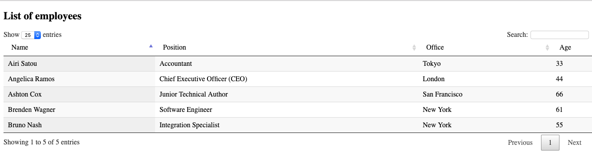

# go-application-starter-kit

A little go application starter kit for application development. Built-in error log,events log, auth, mux,and Middleware etc.

### How to use

1. Single instance(Singleton): only one instance can runing

       Singleton()

2. Error log:

       errLog.Fatal("[error]opening error file: %v", err)
       
3. Events log:

       logger.Println("Start......")

### Middleware

1. loggingMiddleware
2. authenticationMiddleware

### Getting Started

Cloning the latest version

     git clone https://github.com/jun283/go-application-starter-kit.git

### A simple

